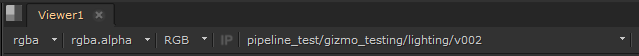

# Nuke

## Remote Rendering/Processing

To send instances off to remote processing you can use the ```Processing Location``` tool to setup the renderlayers. You'll find the ```Processing Location``` tool under the ```pyblish-grill``` menu.

## Workspace Loader

When you have processed a node, you can load the resulting work files into Nuke with the ```Workspace Loader```.   
You can find the ```Workspace Loader``` under the ```pyblish-grill``` file menu.

## Ftrack

When launching Nuke from Ftrack there will be an initial setup of the script, depending on the custom attributes that are available. These custom attributes will be queried from the parent entity of the task.

Description | Ftrack Attributes | Nuke Project Settings Knob
--- | ---
First frame of frame range | fstart | first_frame
Last frame of frame range | fend | last_frame
Frame rate | fps | fps
Resolution width | width | format
Resolution height | height | format

Once these settings are set, they will not be set again. You can force the settings to be applied on start up, by unchecking the attributes in the ```Ftrack``` tab of Project Settings.

### LUT

If a LUT is published to any of the launched tasks parents, ei. its shot, sequence or project, it will use the closest related LUT as a ViewerProcess in Nuke. You can see which LUT is being loaded in the Viewer controls:



### Scan for unused components

If you are launching a script that has assets already imported, the script will be checked if you are not using some components from the asset and prompt you to import them.

You can also manually invoke this from the ```pyblish-grill``` menu.

# [BACK](index.md)
